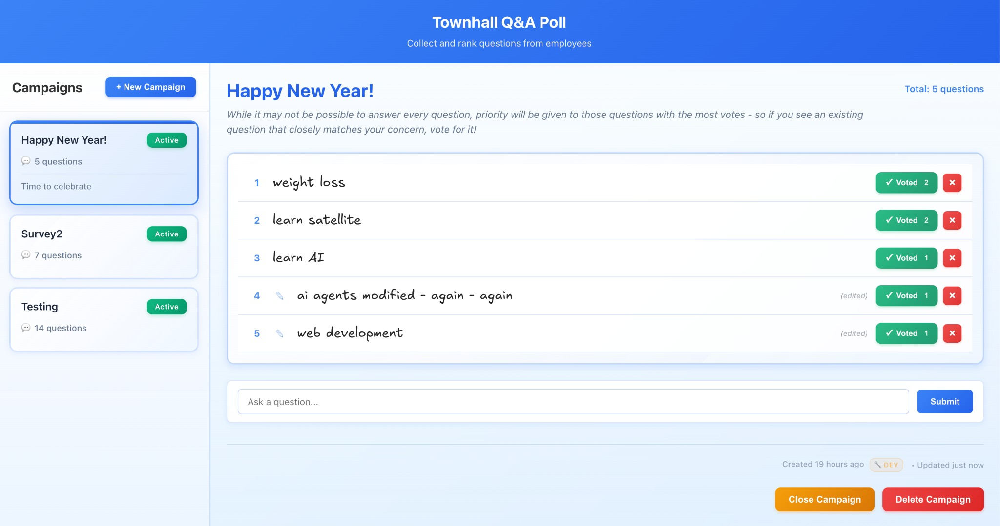

# Townhall Q&A Poll Application

A web application that helps collect and rank the top 5 questions from employees to discuss in town hall meetings.



## Features

- **Campaign Management**: Moderators can create new poll campaigns with optional initial questions
- **Question Submission**: Employees can anonymously submit questions
- **Voting System**: Employees can upvote questions they want to see answered
- **Top 5 Display**: Questions are automatically sorted by vote count, with the top 5 prominently displayed
- **Anonymity**: All interactions are anonymous - only localStorage-generated IDs are used
- **Duplicate Prevention**: Each user can only vote once per question (enforced via localStorage ID)

## Tech Stack

- **Frontend**: React 18 with Vite
- **Backend**: Node.js with Express
- **Database**: SQLite (local file-based database)

## Project Structure

```
TownhallQAPoll/
├── frontend/          # React frontend application
├── backend/           # Node.js/Express backend API
├── package.json       # Root package.json with convenience scripts
└── README.md          # This file
```

## Setup Instructions

### Prerequisites

- Node.js (v16 or higher)
- npm or yarn

### Installation

1. Install dependencies for both frontend and backend:

```bash
npm run install:all
```

Or install them separately:

```bash
cd backend && npm install
cd ../frontend && npm install
```

### Running the Application

1. Start the backend server (in one terminal):

```bash
npm run start:backend
# or for development with auto-reload:
npm run dev:backend
```

The backend will run on `http://localhost:3001`

2. Start the frontend development server (in another terminal):

```bash
npm run start:frontend
# or:
npm run dev:frontend
```

The frontend will run on `http://localhost:3000`

3. Open your browser and navigate to `http://localhost:3000`

## Usage

### For Moderators

1. Click "New Campaign" to create a new poll
2. Enter a campaign title (required)
3. Optionally add a description and/or an initial question
4. Click "Create Campaign"

### For Employees

1. Select a campaign from the left pane
2. View questions in the right pane (sorted by vote count)
3. Click "↑ Upvote" on questions you want to see answered
4. Click "Ask a Question" to submit a new question
5. The top 5 questions are highlighted and shown at the top

## Database

The SQLite database is automatically created in `backend/data/townhall.db` on first run. The schema includes:

- **campaigns**: Stores poll campaigns
- **questions**: Stores questions within campaigns
- **votes**: Tracks upvotes with duplicate prevention

## API Endpoints

- `GET /api/campaigns` - List all campaigns
- `POST /api/campaigns` - Create new campaign
- `GET /api/campaigns/:id/questions` - Get questions for a campaign
- `POST /api/campaigns/:id/questions` - Create new question
- `POST /api/questions/:id/upvote` - Upvote a question
- `GET /api/questions/:id/votes` - Check if user has voted

## Anonymity & Privacy

- No personal information is collected or stored
- Each user is assigned a unique ID stored in localStorage
- This ID is used only to prevent duplicate votes
- The ID persists across sessions but is not linked to any personal data

## Development

### Backend Development

The backend uses nodemon for auto-reload during development. Start with:

```bash
cd backend
npm run dev
```

### Frontend Development

The frontend uses Vite for fast development. Start with:

```bash
cd frontend
npm run dev
```

## License

ISC

